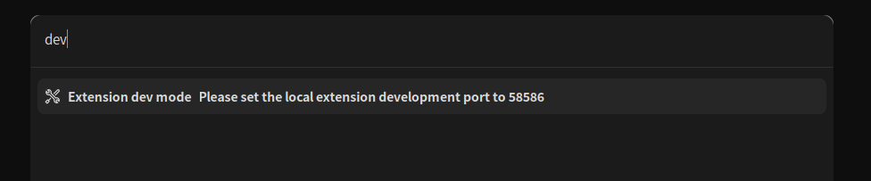

# launcher extension sample

It's https://github.com/fzdwx/launcher extension sample

## dev

```shell
pnpm install
pnpm run dev
```

and start `launcher` type dev


## publish

You must build and commit `dist` folder

```shell
## e.g
pnpm build
git add ./dist/*
git commit -m "feat: realease"
```

Modify `package.json`

```json
{
  "name": "my-plugin-test-fzdwx",
  "version": "0.0.0",
  "launcher": {
    "icon": "https://raw.githubusercontent.com/fzdwx/launcher-extension-sample/main/public/favicon.ico",
    "description": "测试插件",
    "author": "fzdwx",
    "name": "my-plugin-test-fzdwx"
  }
  /* ...*/
}
```

Create pr to https://github.com/fzdwx/launcher-extension

add https://github.com/fzdwx/launcher-extension/blob/main/extensions.json you extension


